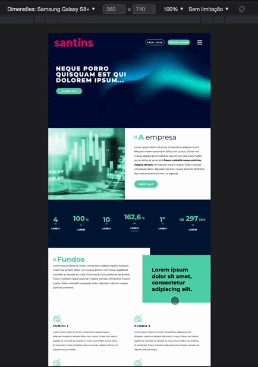

# Projeto Santins

## Projeto realizado para teste técnico da empresa Santins

### Para acesso aos arquivos e visualização da página siga os passos:

Insira o comando abaixo no seu terminal

> git clone https://github.com/t0rciv/practice-santins.git

Navegue pelo terminal até a pasta onde o projeto foi clonado e digite o comando

> npm install

Para executar o projeto execute a linha abaixo

> npm run dev

No navegador digite o seguinte endereço:

> http://127.0.0.1:5173/

## Versão Mobile

> A versão mobile foi construída levando em conta o tamanho de tela do Smartphone Samsung Galaxy S8+

360 x 740

